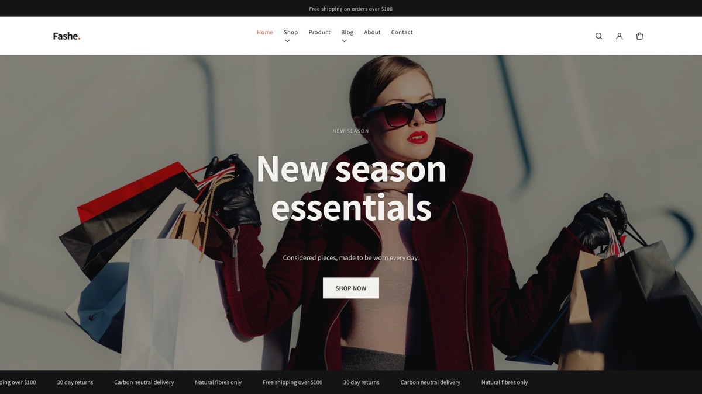
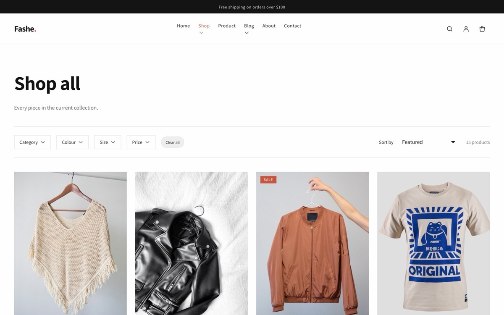
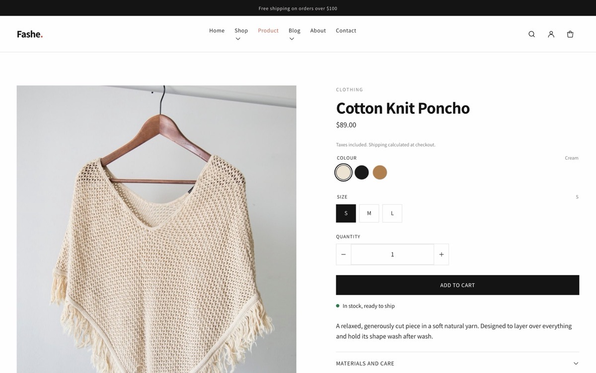
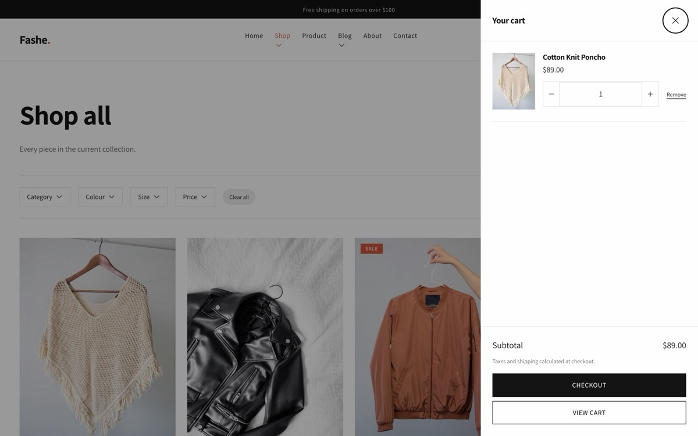
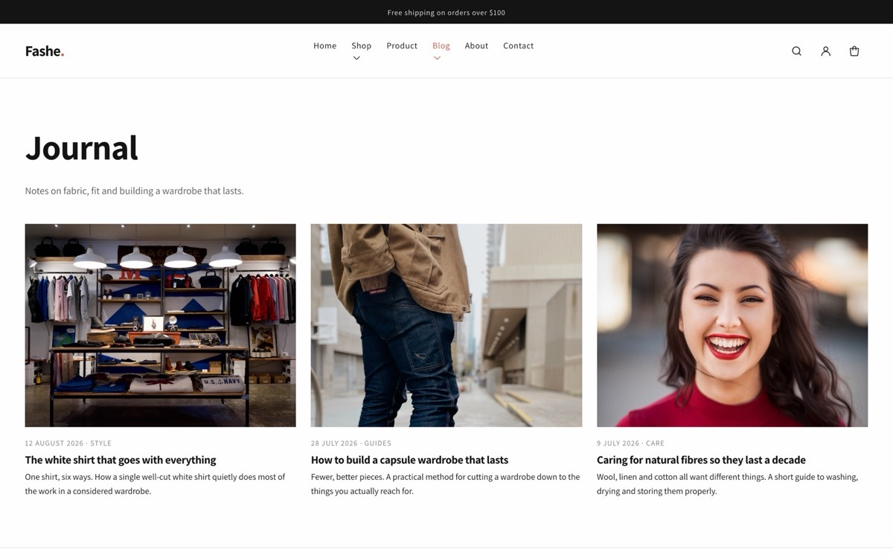
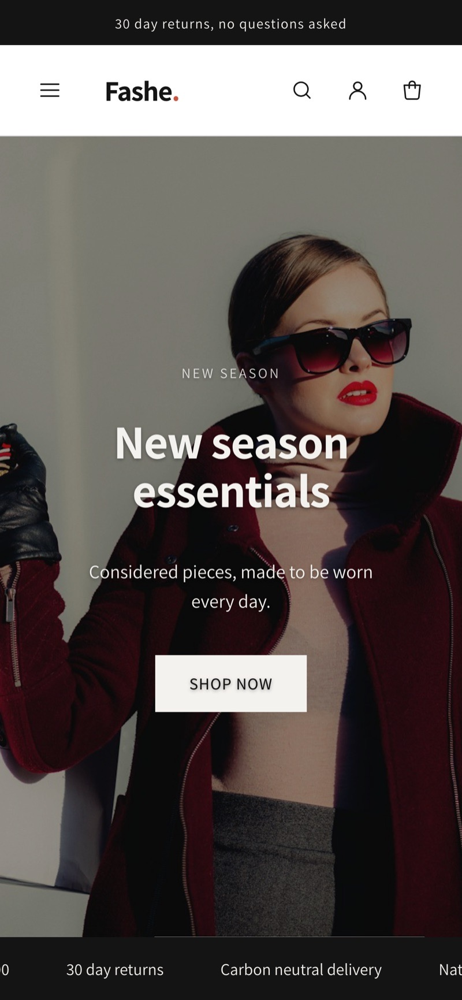
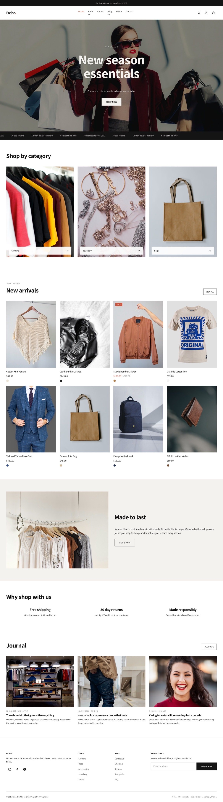
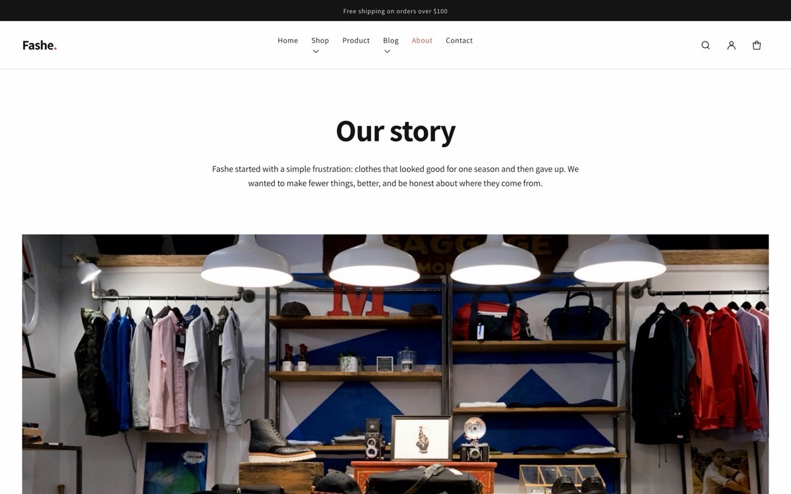

<h1 align="center">Fashe — free Shopify theme for fashion and apparel</h1>

<p align="center">
  An open-source Shopify theme for clothing, accessories and boutique stores, rebuilt in 2026
  on Online Store 2.0 theme blocks.<br>
  No jQuery, no CSS framework, no third-party assets — one stylesheet and one ES module.
</p>

<p align="center">
  <a href="https://preview.colorlib.com/theme/fashe/"><strong>Live preview</strong></a> ·
  <a href="https://downloads.colorlib.com/theme/fashe-shopify-theme.zip"><strong>Download the theme</strong></a> ·
  <a href="https://colorlib.com/wp/themes/fashe-free-shopify-ecommerce-theme/"><strong>Theme page &amp; FAQ</strong></a>
</p>

<p align="center">
  
  
  
  
</p>

<p align="center">
  
</p>

## Preview

**[preview.colorlib.com/theme/fashe](https://preview.colorlib.com/theme/fashe/)**

The preview is a static build of the same design rather than a live storefront —
`assets/base.css` here and the stylesheet behind the preview are the same file, so what
you see is what the theme renders. Cart, filtering, sorting and predictive search are all
demonstrated there; on a real store they run against Shopify's own APIs.

| | |
|---|---|
|  |  |
| **Collection page** — filter by category, colour, price and size | **Product page** — built from movable theme blocks |
|  |  |
| **Cart drawer** — ajax, no page reload | **Blog** — with an about page and full customer accounts too |

<p align="center">
  
  <br><b>Mobile</b> — drawer navigation, scroll-snap carousels, thumb-sized tap targets
</p>

<details>
<summary>The whole homepage, and the about page</summary>
<br>


</details>

## What you get

- **Three homepage layouts** — full-width hero, promotional, and a split layout with fixed
  side navigation.
- **Filterable catalogue** — category, colour, price and size, with sorting, through
  Shopify's free Search & Discovery app.
- **Product pages built from blocks** — title, price, variant picker, quantity, buy
  buttons, stock status, description and collapsible rows, each movable in the editor.
- **Ajax cart drawer** with quick add straight from the product grid.
- **Predictive search** — product, collection, article and page suggestions as you type.
- **Colour and image swatches** driven by your own Shopify product options.
- **Multi-currency and multi-language** through Shopify Markets.
- **Blog, about, contact** and the full set of customer account pages.
- **Four editable colour schemes**, applied per section, plus font pickers and layout
  controls.

## What it is, technically

Fashe 2.0 is a **theme-blocks theme** — the newest Shopify theme architecture, the same
generation as Shopify's Horizon themes. Merchants can add, remove, reorder and nest blocks
inside sections directly in the theme editor, including on the product page.

| | Fashe 1.x (2018) | Fashe 2.0 |
|---|---|---|
| `shopify theme check` | 48 errors, 21 warnings | **0** |
| Architecture | Vintage (pre Online Store 2.0) | Theme blocks + JSON templates + section groups |
| Editable in the theme editor | Homepage only | Every template |
| Stylesheets on the homepage | 19 | 1 |
| Scripts on the homepage | 34 | 1 (ES module) |
| jQuery | 3.2.1 | none |
| CSS framework | Bootstrap 4 | none — ~1,600 lines of plain CSS |
| Carousels | Slick + Owl + bxSlider | CSS scroll-snap |
| Lightbox / popups | Lightbox2, Magnific Popup, SweetAlert, Toastr | native `<dialog>` |
| Icons | 4 icon fonts (Font Awesome, Themify, Linearicons, Elegant) | inline SVG |
| Sass | 13 `.scss.liquid` / `.css.liquid` files | none (Shopify no longer supports Sass) |
| External CDNs | 4 (bootstrapcdn, jsdelivr, cdnjs ×2) | none |
| Currency switching | Hard-coded currency list | Shopify Markets |
| Filtering | none | Search & Discovery filters |
| Translatable editor labels | partial | all 386 |
| `` (deprecated) | 148 uses | 0 — `` throughout |
| Cart | Page reload | Ajax cart drawer via the Section Rendering API |
| Colour schemes | 14 individual colour settings | 4 editable colour schemes, per section |
| Theme file size | 2.9 MB | 98 KB |

## Installing

Download [`fashe-shopify-theme.zip`](https://downloads.colorlib.com/theme/fashe-shopify-theme.zip)
and upload it in **Online Store → Themes → Add theme → Upload zip file**. Do not unzip it
first — Shopify expects the archive. Then click **Customize** to set your logo, colours and
menus, and **Publish** when you are happy.

To work on it locally:

```bash
npm install -g @shopify/cli
shopify theme dev --store your-store.myshopify.com   # live preview
shopify theme check                                  # lint (currently: 0 offenses)
shopify theme push                                   # upload
```

## Structure

```
assets/          base.css (design system), theme.js (custom elements)
blocks/          14 theme blocks — reusable and nestable across sections
config/          settings_schema.json, settings_data.json (4 colour schemes, 2 presets)
layout/          theme.liquid, password.liquid
locales/         en.default.json (213 storefront strings)
                 en.default.schema.json (386 theme-editor strings)
sections/        36 sections + 2 section groups (header, footer)
snippets/        18 shared partials (product card, price, cart, facets, schema…)
templates/       19 JSON templates + gift_card.liquid
```

### Theme blocks

`blocks/` holds blocks merchants can place in any section that accepts `@theme`:

`title` `vendor` `price` `variant-picker` `quantity` `buy-buttons` `inventory`
`description` `accordion` `heading` `text` `button` `image` `group`

`group` accepts child blocks, so layouts can be nested without code.

### JavaScript

One ES module, ~650 lines, all behaviour as custom elements that no-op when their
element is absent:

`quantity-input` `product-form` `cart-drawer` `cart-page` `variant-picker`
`product-gallery` `predictive-search` `announcement-rotator` `address-form`

Filtering, cart updates and search results use the Section Rendering API, so Liquid
stays the single source of truth for markup.

### Performance notes

- One stylesheet, one module script, zero external requests.
- All images use `image_tag` with `srcset`, `sizes`, explicit dimensions and lazy
  loading; the hero and first product image are `eager` + `fetchpriority="high"`.
- Carousels and the product gallery are CSS scroll-snap — no carousel library.
- Drawers are native `<dialog>`, so focus trapping, `Esc` and inert backgrounds are
  free.
- Motion is disabled under `prefers-reduced-motion`.

### SEO and structured data

Product and BlogPosting JSON-LD, a clean heading order, canonical URLs, Open Graph and
Twitter card tags, responsive images with alt text taken from your product data, and no
render-blocking library stack in front of the first paint.

### Accessibility

Skip link, visible focus rings, labelled form inputs, `aria-current` navigation,
`role="listbox"` search suggestions, 24px+ touch targets, and alt text driven by
`image.alt` throughout.

## Upgrading from Fashe 1.x

Treat 2.0 as a new theme, not an update. Upload it alongside your current live theme, set
it up in the editor, preview it, and publish when it looks right. There is no automatic
migration of 1.x settings — the two versions have completely different section and block
structures, which is exactly why 2.0 can be edited on every template instead of only the
homepage.

The v1 issue backlog was reviewed and closed against this rewrite in September 2026: the
cart, the colour settings, the Instagram feed, the currency converter and the deprecated
`` calls that those reports were about no longer exist. If you hit any of it
on 2.0.1, please open a new issue.

## Known gaps

- Only English ships. Both locale files are complete and fully keyed, so adding a
  language is a matter of translating `en.default.json` and `en.default.schema.json`.
- Not yet rendered against a live store — see CHANGELOG.

## Contributing

Issues and pull requests are welcome. Please run `shopify theme check` before opening a
PR; the theme is at zero offenses and should stay there.

## Licence

`ColorlibHQ/Fashe` has never carried a `LICENSE` file, across 63 forks and several merged
community pull requests, so the terms are not yet stated here. This is being settled — do
not assume MIT. In the meantime the theme is published as a free download for use on
Shopify stores; if you need the position in writing before you build on it, ask at
[colorlib.com/wp/support](https://colorlib.com/wp/support/).
